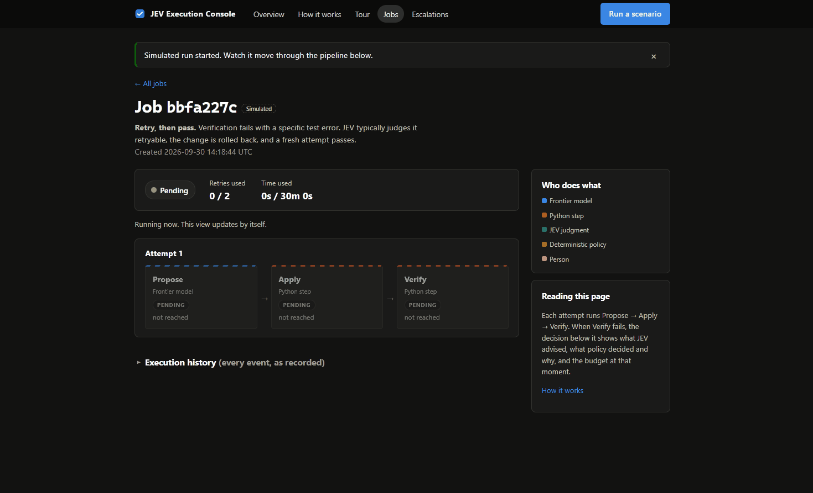
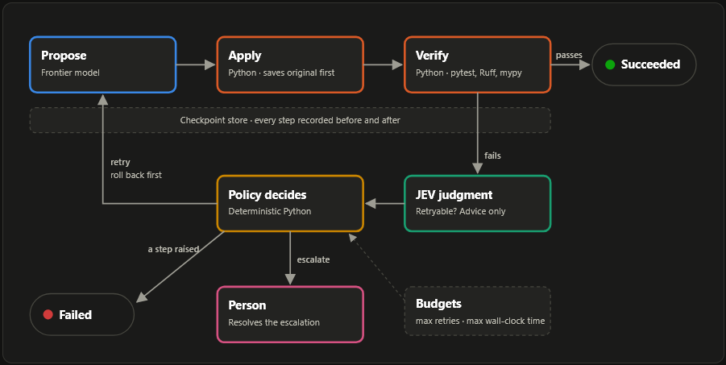
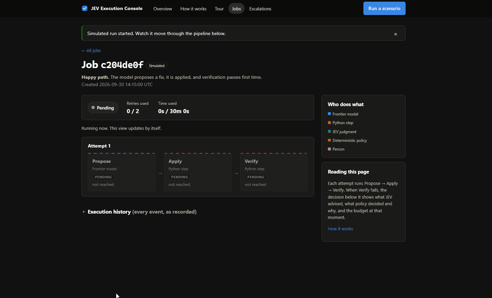
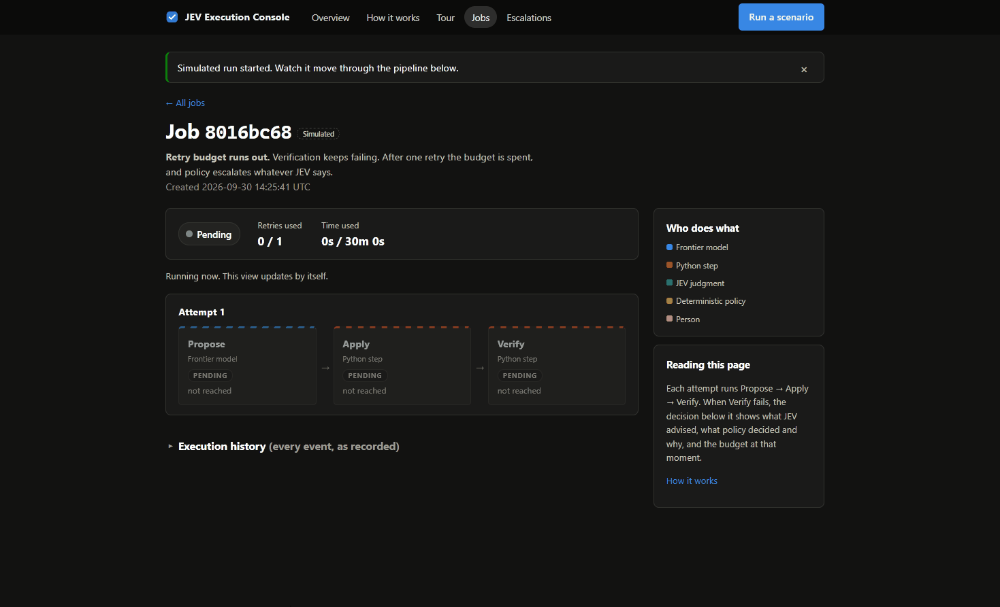

# JEV-Governed Reliable Engineering Agent

**The AI proposes. Plain rules decide. A person has the last word.**

A reliability layer around an AI coding agent. A frontier model (Claude) investigates a bug and proposes a fix; deterministic Python decides what happens next. The layer checkpoints every step, recovers from crashes, retries within a budget, consults a narrow JEV judgment, and escalates to a person instead of guessing. A local web console lets you watch all of it happen live.



---

## Why this exists

AI agents can now read a bug report, search a codebase and write a fix. The hard part is trusting them when nobody is watching. A plain agent script:

- loses everything if the process crashes halfway,
- can retry forever, or on top of its own broken change,
- keeps trying on problems no code change can fix,
- leaves no explanation when it fails.

This project does not make the AI smarter. It wraps the AI in ordinary, load-bearing engineering (saved progress, limits, written rules, records, and a way to ask a human) so it is safe to run unattended.

## How it works



Every job runs the same loop, and five players each have a clear limit:

| Player | What it does | What it is never allowed to do |
| --- | --- | --- |
| **Frontier model** (Claude) | Reads the ticket, searches the code, proposes one file change | Decide what happens next or change a job's status |
| **Python steps** | Save the original file, write the fix, run pytest, Ruff and mypy | Make judgment calls |
| **JEV judgment** | Answers one narrow question: "is this failure worth retrying?", with a confidence | Run jobs, pick actions, or overrule the rules |
| **Deterministic policy** | Plain Python rules; the only thing that sets a job's status | Guess: the same inputs always give the same decision |
| **Person** | Reads why a job stopped and records a decision | (Acts by choice; resolving never restarts a job) |

After a failed Verify, the policy decides in a fixed order:

1. Retry or time budget spent → **escalate**, whatever JEV said.
2. JEV unavailable, or under 50% confident → ignore JEV, **retry** while budget remains.
3. JEV confident the failure is not retryable → **escalate**.
4. Otherwise → **retry**, after rolling the file back.

### The six safety habits

| Habit | In plain words |
| --- | --- |
| **Checkpoints and recovery** | Each step is recorded before it starts and after it finishes. After a crash, the job resumes at the first unfinished step; completed work is never redone. |
| **Bounded retry with rollback** | A failed attempt's file change is undone, then a fresh attempt starts from Propose, a limited number of times. |
| **Narrow AI judgment** | JEV gives advice on one question. It never decides. |
| **Deterministic policy** | Written rules make every decision and fall back to a fixed rule when JEV is down or unsure. |
| **Budgets** | Max retries and max wall-clock time per job. Running out forces escalation. |
| **Escalation and history** | The job stops with a written reason and waits for a person. Every transition, retry, judgment and escalation is recorded permanently. |

## See it in action

| Happy path | Retry budget runs out → escalation |
| --- | --- |
|  |  |

In the console you pick a **story** and watch the job move through the pipeline. Each story shows one pattern:

| Story | What happens | What it proves |
| --- | --- | --- |
| Happy path | Propose, Apply, Verify pass first time | The governed, checkpointed pipeline |
| Crash and resume | The process "dies" during Verify; you click **Resume** | Recovery without redoing completed steps |
| Retry, then pass | A specific test fails, the change is rolled back, attempt 2 passes | Bounded retry with rollback, JEV advising |
| JEV says stop | Tests can't start: the environment is broken | JEV judgment under policy authority |
| Retry budget runs out | Tests keep failing; one retry allowed | Budgets override everything, including JEV |
| Time budget runs out | Only 3 seconds of budget; the failure arrives after ~4 | The time budget overrides a confident JEV |
| A step raises | The model call itself fails | A crashing step ends the job as Failed |

In stories, the safety system and the JEV judgment are **real**; only the coding steps (Propose, Apply, Verify) are simulated, so demos are fast, repeatable, spend no Anthropic credit and never touch the real code.

## Quick start

Requires Python 3.12+ and Git. Commands are for Windows PowerShell; on macOS/Linux use `source .venv/bin/activate` and `export`.

```powershell
git clone https://github.com/AviDhingra/autonomous-systems-engineer.git
cd autonomous-systems-engineer
python -m venv .venv
.\.venv\Scripts\Activate.ps1
pip install -e ".[dev]"
```

Set your TypeSafe key for live JEV judgments (optional; without it the console shows a banner and policy uses its fixed retry rule):

```powershell
$env:TYPESAFE_API_KEY = "<your key>"
```

Start the console and open <http://127.0.0.1:8000>:

```powershell
python -m jev_agent.console --database-url sqlite:///./demo_console.db
```

Then:

- **Overview**: the pitch, headline numbers, recent jobs.
- **How it works**: the diagram above and who holds authority.
- **Tour**: six patterns, each with a story to run.
- **Run a scenario** (top right, every page): pick a story and watch it live.
- **Jobs**: filter by status, simulated/real, story, or job id.
- **Escalations**: read why a job stopped and mark it resolved with a note.

**Start fresh:** stop the console (Ctrl+C), delete `demo_console.db`, start again. **Pre-fill every page** with one finished job per story (a few TypeSafe calls):

```powershell
python -m jev_agent.demo_console_seed --database-url sqlite:///./demo_console.db --reset
```

The console binds to `127.0.0.1` only, has no authentication, runs one simulated job at a time, and never starts a real run.

## Real runs (costs API credit)

The command-line demos run the real Claude agent against the real FleetOps code. They need `ANTHROPIC_API_KEY` and `TYPESAFE_API_KEY`, take a few minutes, and write to `./jev_agent.db`:

```powershell
python -m jev_agent.demo_retry         # bounded retries on a forced VERIFY failure
python -m jev_agent.demo_judgment      # a real JEV judgment on a failed VERIFY
python -m jev_agent.demo_escalation    # a job that would retry forever hits its budget
python -m jev_agent.console            # browse those jobs (reads ./jev_agent.db)
```

These demos inject the scenario's bug before running and restore `target/fleetops` afterwards. `python -m jev_agent.main` (start or resume a governed job) does **not** inject the bug: apply `scenarios/S02-unsupported-patch-fields/bug.patch` first, or the agent spends credit hunting for a bug that isn't there.

### The underlying agent (Project 1)

`src/ase` is the original one-shot agent this layer governs, left unchanged. It reads code with bounded `read_file` / `search_code` tools, returns one structured `FixProposal`, may only write an existing file under `target/fleetops/app/`, and counts a fix as verified only when pytest, Ruff and mypy all pass. To run it ungoverned on scenario S01:

```powershell
git apply scenarios/S01-duplicate-telemetry/bug.patch
python -m ase.main
```

## Design choices

| Choice | Why |
| --- | --- |
| Wrap the agent; don't rewrite it | Reliability shouldn't depend on the AI behaving well |
| Only the policy changes job state | The power to decide what runs next belongs to rules we can read and test |
| JEV answers one bounded question | Easy to check, and easy to ignore when unsure |
| Budgets beat everything | The last line of defence against runaway cost |
| Escalate instead of failing silently | "I'm stuck, and here's why" is a feature |
| Resolving an escalation records a note only | A human decision never triggers hidden automation |
| SQLite and plain Python, no workflow frameworks | Simple enough to read and trust; honest about single-machine scope (no LangChain, LangGraph, Celery, Temporal or Kubernetes) |
| Specs before code, one milestone at a time | Each piece designed, tested and reviewed before the next |

## Repository layout

```text
src/ase/                Project 1: the AI coding agent (the governed workload)
src/jev_agent/          Project 2: the reliability layer
  runner.py             runs a job: steps, checkpoints, retries, rollback, escalation
  policy.py             the deterministic decisions
  judgment.py           the one JEV judgment
  recovery.py           where to resume after a crash
  store.py, db.py       SQLite store: jobs, checkpoints, history, escalations
  simulation.py         the console's stories
  console/              the FastAPI + Jinja2 + htmx execution console
target/fleetops/        the app whose bugs get fixed
scenarios/              fault scenarios (S01, S02)
specs/                  mission, architecture, roadmap, and one spec folder per milestone
tests/                  pytest suites for both projects
demo_gifs/              the images in this README
```

## Development

```powershell
python -m pytest -q
python -m ruff check src/ase tests/ase target/fleetops src/jev_agent tests/jev_agent
python -m mypy src/ase target/fleetops src/jev_agent
```

Tests never need the network or an API key. Work follows the specs in `specs/` (`mission.md`, `architecture.md`, `roadmap.md`), one milestone at a time:

| Milestone | Delivered |
| --- | --- |
| 1 · Durable core | Jobs, SQLite store, checkpointed steps, crash recovery |
| 2 · Failure handling | Deterministic retry policy, bounded retries, idempotency |
| 3 · JEV judgment | The live TypeSafe JEV judgment, consulted by policy |
| 4 · Budgets and escalation | Retry and time budgets, escalations, complete history |
| 5 · Execution console | Local web console over the store; resolve escalations |
| 6 · Console experience | Overview, diagram, tour, live stepper, simulated stories (final sign-off pending) |

## Limits

A learning-focused demonstration, not a production service: one job at a time on one machine, a local SQLite file, no authentication, and one repair workload (FleetOps). With the live API, JEV's answer can differ from a story's typical path; the policy still decides, and the job page shows exactly what JEV said and why policy acted as it did.
